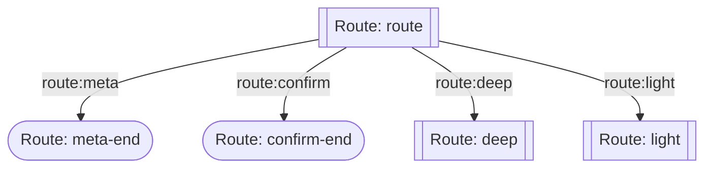
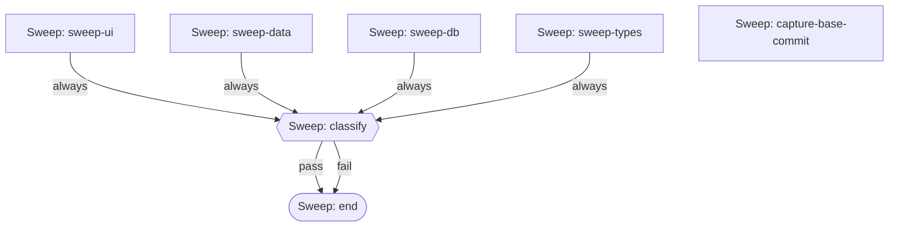
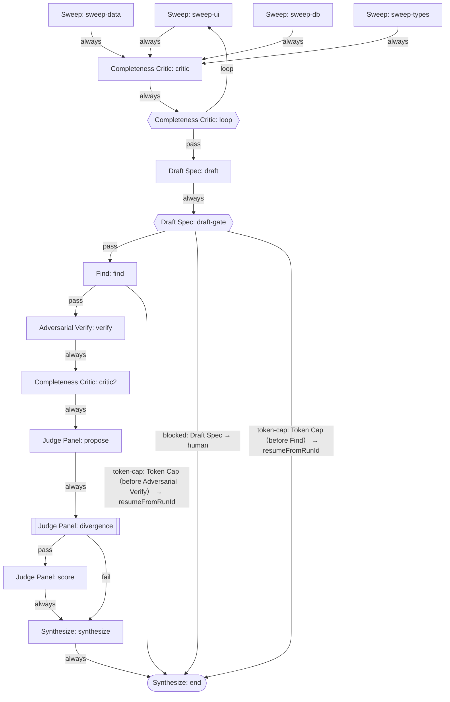
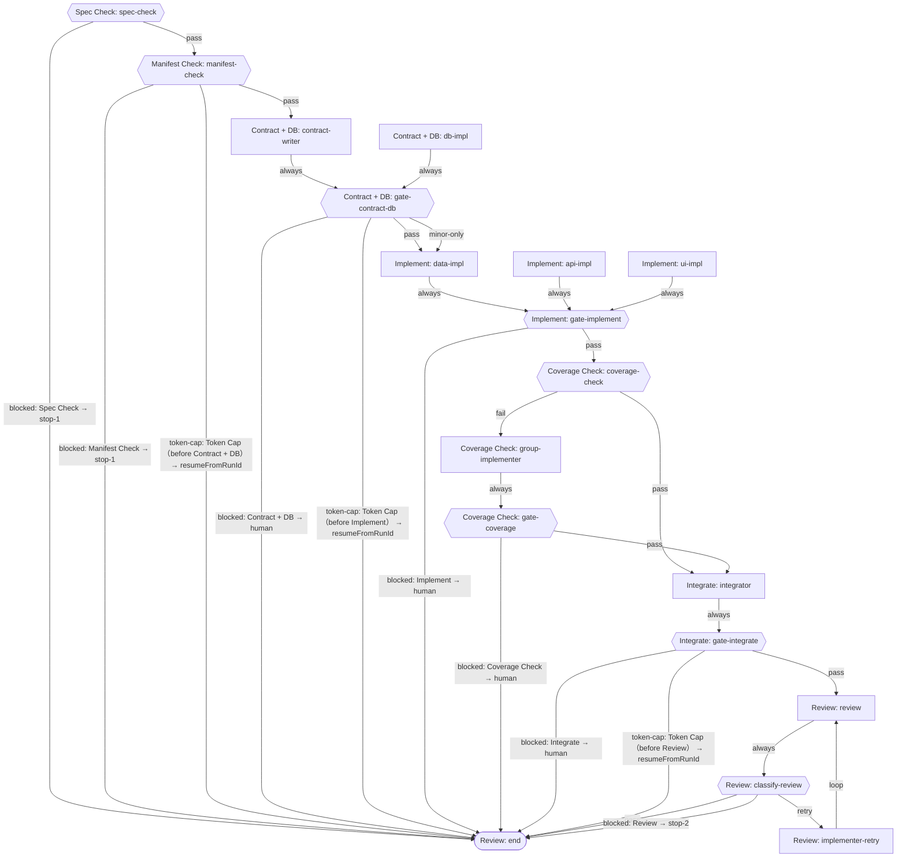

<!-- GENERATED FILE — DO NOT EDIT. Source: .claude/workflows/graph/aidd-graph.mjs. Regenerate: node scripts/lib/render-aidd-graph.mjs (issue #710) -->
# AIDD パイプライン配線図（生成物）

正本は `.claude/workflows/graph/aidd-graph.mjs`。このファイルと `docs/aidd-pipeline.html` は
`node scripts/lib/render-aidd-graph.mjs` で生成する（手編集禁止。鮮度は
`scripts/check-aidd-graph-rendered.test.sh` が検査）。マニフェストと各 Workflow DSL の一致は
`.claude/workflows/lib/__tests__/graph-manifest-sync.test.js` が `npm test` で検査する（issue #710）。

## 人間ゲート

- **停止①（仕様レビュー）**（`stop-1`）: SPEC.md Part 1 を人間が承認し、.aidd/run-manifest.json に approval と specHash を記録するまで Phase 3 へ進まない（再開: `aidd-phase2`）
- **停止②（構造化レビュー）**（`stop-2`）: /structured-review を人間が起動するまで勝手に実行しない。Review で blocked / 3 回差し戻しても fail が残る場合はここへ引き渡す

## aidd-phase1-router（`aidd-phase1-router.js`）

パターン: routing

## aidd-phase1（`aidd-phase1.js`）

パターン: parallelization

## aidd-1-1-deep-task（`aidd-1-1-deep-task.js`）

パターン: orchestrator-workers + evaluator-optimizer（Loop Until Dry）

予算・上限:
- `DEFAULT_TOKEN_CAP` = 2,000,000
- `MIN_BUDGET_FOR_SWEEP_ROUND` = 400,000
- `maxRoundsDefault` = 3
- `dryRoundsToConverge` = 2
- `finders` = 5
- `proposers` = 3
- `scoreLenses` = 3

blocked / token-cap の復帰先:

| blockedAt | 復帰先 | 備考 |
|---|---|---|
| `Draft Spec` | 人間（オーケストレーターが detail を読んで判断） | fail / blocked / null はすべて中断。taskDescription・maxRounds を見直して再実行 |
| `Token Cap (before Find)` | resumeFromRunId（docs/agents/workflow-resume-runbook.md） |  |
| `Token Cap (before Adversarial Verify)` | resumeFromRunId（docs/agents/workflow-resume-runbook.md） |  |

## aidd-phase2（`aidd-phase2.js`）

パターン: prompt chaining + parallelization + evaluator-optimizer（Review 差し戻し）

予算・上限:
- `DEFAULT_TOKEN_CAP` = 2,500,000
- `MAX_REVIEW_RETRIES` = 3
- `reviewDimensions` = 4

blocked / token-cap の復帰先:

| blockedAt | 復帰先 | 備考 |
|---|---|---|
| `Spec Check` | 停止①（仕様レビュー） | SPEC.md が無い / Part 2 が無い。specPath（絶対パス）を直して再実行 |
| `Manifest Check` | 停止①（仕様レビュー） | approval 未記録 / specHash 不一致。停止①をやり直す |
| `Token Cap (before Contract + DB)` | resumeFromRunId（docs/agents/workflow-resume-runbook.md） |  |
| `Contract + DB` | 人間（オーケストレーターが detail を読んで判断） | detail を読み、SPEC 修正（→停止①）か再実行かを判断 |
| `Token Cap (before Implement)` | resumeFromRunId（docs/agents/workflow-resume-runbook.md） |  |
| `Implement` | 人間（オーケストレーターが detail を読んで判断） |  |
| `Coverage Check` | 人間（オーケストレーターが detail を読んで判断） |  |
| `Integrate` | 人間（オーケストレーターが detail を読んで判断） | 3 回修正しても test/lint/tsc が赤 |
| `Token Cap (before Review)` | resumeFromRunId（docs/agents/workflow-resume-runbook.md） | Review ループの各ラウンド先頭で判定 |
| `Review` | 停止②（構造化レビュー） | レビュー自体ができない観点がある、または 3 回差し戻しても fail が残る |

